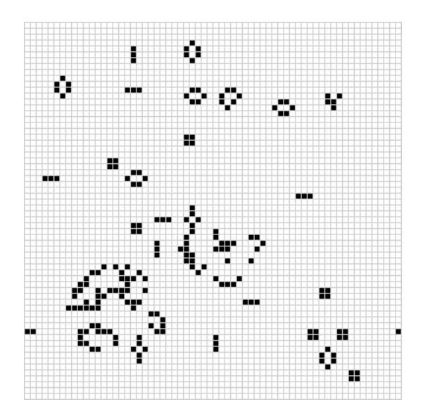

# wasm-game-of-life

[Conway's Game of Life](https://en.wikipedia.org/wiki/Conway%27s_Game_of_Life) on the browser with [WebAssembly](https://webassembly.org/ "WebAssembly website") 🕸, built with [Rust](https://www.rust-lang.org "Rust language website") 🦀.

This project is an adaptations of the sample codes found in the [rustwasm book](https://rustwasm.github.io/book/ "rustwasm book") and contains code directly drawn from its contents. Thus, it strives to accord with the rustwasm book licensing terms.

## 🚴 Running

You'll need npm and the Node.js runtime in order to run install the dependencies and run it. You can download both in one take from the [Node.js project website](https://nodejs.org/en/)

1. Clone this repository anyware in your machine;
2. **Move to the project root folder**;
3. Execute `npm install` to install and configure the dependencies;
4. Run the web server on port 8080 with `npm run start`;
5. Point your browser to `http://localhost:8080` to see it in action!; 😲

## Files

- You can peek the essential Rust code used to generate the `.wasm` in `rust/lib.rs`;
- The generate `.wasm` and respective JavaScript bindings can be found in `src/lib/`;
